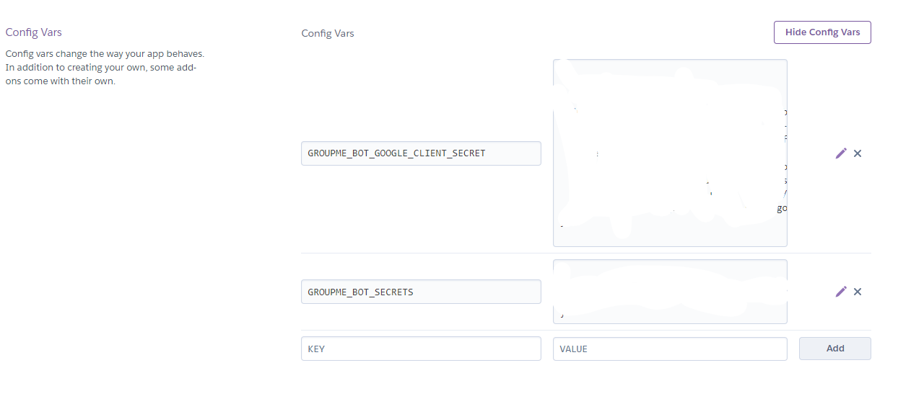

# Set Up
This tutorial will get you fully set up and deployed. You will be equipped to run the bot locally and contribute if you find any bugs. If you just want to deploy the bot and don't care about being able to help maintain it, you can skip the steps with a * before them.

I suggest you make a dummy groupme and go through this with that. Then when you have it working, you can go back through with your real groupme.

- Fork this project to your own repository.
- * Create a copy of `secrets.template.json` named `secrets.json`.
- Register a bot with groupme. 
  - * Add your bot_token to `secrets.json`.
- * Add the requests library with `pip install requests`
##### Google Setup
- Register your sheet with Google Cloud Platform
  - * Run `pip install --upgrade google-api-python-client google-auth-httplib2 google-auth-oauthlib` to get the needed libraries.
  - Use open Google's Cloud Console (console.cloud.google.com), open a project and enable the sheets API.
  - Create a service account.
    - Generate a key pair for it. Save the private key as `google_client_secret.json` in the root directory of the project.
    - Similar to this https://denisluiz.medium.com/python-with-google-sheets-service-account-step-by-step-8f74c26ed28e
- Create your Google Form. Share the sheet created by it with your Google Service Account's email.
  - It should have two questions: first the persons name and then their prayer request
  - * Add the spreadsheet_id to `secrets.json`. The url for your sheet looks like "docs.google.com/spreadsheets/d/<spreadsheet_id>/edit"
##### Heroku Setup
- Create a new app. You should also log in to heroku's cli.
- You will need to manually enter your tokens. Go Settings > Reveal Config Variables.
  - You need a variable called `GROUPME_BOT_SECRETS` and one called `GROUPME_BOT_GOOGLE_CLIENT_SECRET`. Copy the contents of your corrosponding files in to the value field. It should look something like this when you're done. 
  
- You can set it up to deploy automatically on commits to main, or just click deploy now just deploy the current version.
- To test that its working, you can run `heroku run -a <app-name> "python bot.py"`
- Follow [this article](https://medium.com/analytics-vidhya/schedule-a-python-script-on-heroku-a978b2f91ca8). They describe how this process works better than I can.
  - You will have to use the "Heroku Scheduler" instead of the "Advanced Scheduler." You also have to put in a credit card, but it shouldn't charge you.

That's it! You're all set!